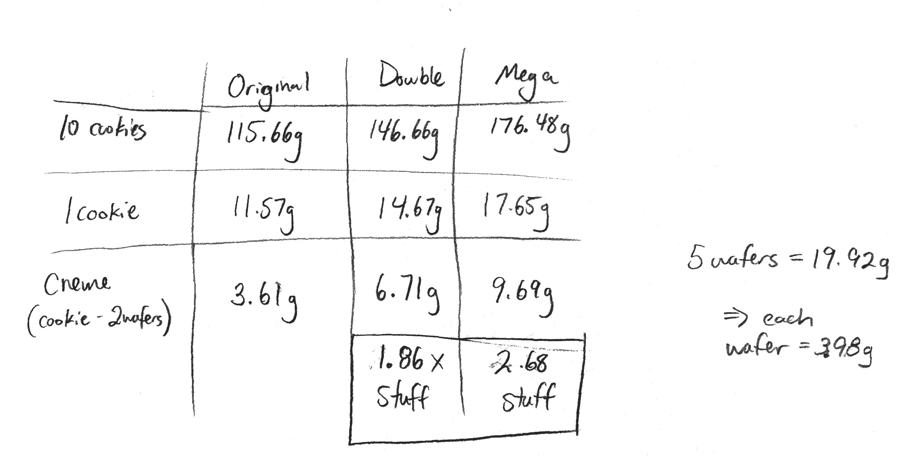

```{r setupFiles, include = FALSE}
# Setting Document Options
knitr::opts_chunk$set(
  echo = FALSE,
  warning = FALSE,
  message = FALSE,
  fig.align = "center"
)

# Add additional packages by name to the following list
packages <- c("tidyverse", "knitr", "kableExtra", "psych", "car",
              "mratios", "boastUtils"
)
lapply(
  X = packages,
  FUN = library,
  character.only = TRUE
)

oreoData <- read.table(
  file = "https://raw.github.com/neilhatfield/STAT461/master/dataFiles/oreo3.dat",
  header = TRUE,
  sep = ","
)

oreoData$Type <- as.factor(oreoData$Type)

```

<!-- This will be an Advanced/Adept Example -->

<!-- *Note to Readers: Keep in mind that this example report still needed to meet the requirements of the assignment (e.g., explaining _every_ statistic) which would not necessarily happen in a standard report.* -->

The exchange of services and goods between people is the foundation of economies worldwide. For as long as consumers have purchased products, goods, and services, there have been instances of less than reputable sellers. One category of such instances deals with claims of false advertising. False advertising occurs when a company's advertisement contains untrue or misleading information about their product [@losangelesdepartmentofconsumerandbusinessaffairs2011]. False advertising negatively impacts consumers in various ways including their physical, mental, and emotional well-being. Additionally, false advertising can undercut consumer confidence in a product, hurting the company's revenue stream.

In the present report, I'll report on investigating a false advertising question: Do Double Stuf Oreos® have twice the créme filling mass as Regular Oreos®? I'll first present some relevant background information, then describe the methods I used to investigate this research question. I'll then describe the collected sample and share the results of my analysis. Finally, I'll close with some discussion of those results and implications.

# Literature Review

A clear cut instance of false advertising is when a company lies about their product in their advertisements. In 2014, L'Oreal was accused of this kind of action when they used the phrase "clinically proven" for several of their skincare products without having any studies behind such claims [@thelawofficesoftoddm.friedmanp.c.2022]. The dietary supplement company Airborne has been accused of false advertising over the idea that their product could protect users from airborne illness. They eventually settled a class-action lawsuit out of court for more than \$23 million [@thelawofficesoftoddm.friedmanp.c.2022]. Volkswagen was found in 2016 to have lied and installed illegal devices to skirt government mandated emissions tests [@thelawofficesoftoddm.friedmanp.c.2022]. In 2022, the Monster Energy Company filed a suit against competitor Vital Pharmaceuticals Inc. (Bang Energy), over their marketing around the purported health benefits of "super creatine". A jury found that Bang Energy had engaged in false advertising around the health benefits when the claims could not be confirmed through any scientific inquiry; the jury awarded Monster Energy over \$271 million [@douglas2023].

In addition to these examples, several food companies have also faced allegations of false advertising in recent years. Subway® has been sued several times for false advertising: for their "footlong" sandwiches being allegedly less than 12 inches long [@goldman2016] and more recently for their tuna salad allegedly not containing any actual tuna [@fitzsimons2021]. Burger King was accused of false advertising by allegedly making their burgers look larger in their advertisements than they are when purchased [@wile2022]. Mondelēz International (the parent company of Nabisco) has faced accusations related to Double Stuf Oreos® [@tepper2013].

## Prior Investigations of Double-Stuf vs. Regular Oreos®

The false advertising allegations that Oreos® has faced over the past decade (at least), directly speak to the present research question. As originally reported by @tepper2013, there is a claim that Double Stuf Oreos® do not actually have twice the amount of créme filling as regular Oreo cookies. Since the original article, several groups have engaged with this particular inquiry. In what follows, I'll discuss the various approaches that have been taken by others.

The original inquiry that began the most recent exploration started with a New York high school math teacher in 2013 [@andersonOreoOriginalVs2013; @andersonOreoData2013; @andersonOreoVerification2013; @andersonFinalOreoPost2013]. Anderson's original method involved weighing 10 regular Oreos, 10 Double Stuf and 10 Mega Stuf Oreos. He then weighed five of the wafers. This process led him to generating the summary table and result shown in Figure \ref{fig:originalOreoData}. He used these various masses to derive a purported créme filling mass for an "average" Oreo. He then then formed the ratios of filling masses with respect to the regular Oreo. 

```{r originalOreoData}
#| fig.cap = "Oreo Data (Anderson, 2013a)",
#| out.width = '80%'

```

While Anderson's approach looks straightforward at first glance, there are multiple issues with this approach. Perhaps the most minor of the criticisms that Anderson received centered on the sample size of 10 cookies. While this is an admittedly small sample, such a sample size is not necessarily a fatal blow to the study. The two biggest issues, which are fatalistic, are Anderson's measurement process and his lack of using statistical tools.

Anderson's approach neglected any variation present within the cookies. By measuring the 10 cookies as a set and then dividing by 10, he effectively smoothed out any potentially important deviations. As a result, Anderson could not make use of any tools of statistical inference to investigate the research question. Statistical methods require at least one measure of variation so that they can allow us to potentially generalize to the broader population. Anderson could not do this. This led Anderson to present a single, flawed point estimate for the ratio without any sense of error in measurement.

After receiving some push back, Anderson re-did his study this time using an entire package of cookies for each type (36 for regular and 30 for Double Stuf) [@andersonOreoVerification2013]. He weighed the complete set of cookies for each type before splitting off one wafer from each cookie. He then weighed the 23 filling-free wafers before engaging in the same mathematical treatment as before. This time, instead of finding the ratio of créme filling masses to be 1.86, he got 1.89.

As part of a third exploration, Anderson aimed to counter questions about whether the weight of the wafers was different between the two types of Oreos [@andersonFinalOreoPost2013]. While this time he attended to a potential difference in wafer mass, he still used the same methodology as before, failing to incorporate the natural variability both between and within types of Oreos. This third study lead him to revise the ratio from the second study to 1.7.

@butterworth2014 undertook their own version of the study. As opposed to Anderson's approach, they weighed each cookie separately as a whole, individual wafers, and then weighed the créme filling. They repeated this process for 60 regular and 60 Double Stuf Oreos. They then used the full data set for their statistical analysis. This allowed them to incorporate the variation in créme filling masses. They then used a ratio test for the values of the sample means. They used a one-tail test with an alternative that the ratio was less than 2. They failed to reject the null hypothesis. They found a 95% confidence interval for the ratio was $(2.028, 2.113)$, suggesting that the actual ratio of créme filling between Double Stuf and regular Oreos might be slightly more than double.

@dorko2017a proposed a similar approach as part of a lesson plan that could be used with high school and middle school students. Part of the lesson plan highlights a common approach students suggest taking to handle the double aspect: multiple the values of the regular Oreo's créme filling masses by two. While this step might seem logical, this action actually has the effect of magnifying the variation in those measurements by a factor of 4. This can become problematic if we then use that scaled data in a standard two independent sample *t* test instead of a ratio test.

Most recently, @truthinadvertising.org2022 repeated Anderson's work and found that Double Stuf did have twice the filling mass as regular. However, they were unclear about their methods and how they reached their answers.

# Methodology

To investigate whether Double Stuf Oreos have twice the créme filling mass as regular Oreos, I will make use of data previously collected for this purpose. Dr. Hatfield worked with an introductory statistics class to investigate whether Double Stuf Oreos have twice the créme filling as regular Oreos. They used a proper process to select a grocery store at random in Tempe, AZ and then to select 9 packages of regular and 9 packages of Double Stuf Oreos from the shelves. They then split these 9 packages into 9 pairs (one of each type of cookie) to measure the créme filling masses (in grams) for each cookie.

I have been given one of these data sets (Oreo 3) to explore in context of the statistical research question "Do Double Stuf Oreos have double the créme filling mass as Regular Oreos?" The heart of this question is comparing the underlying filling processes for these cookies and how those processes behave in the long-run. That is to say, there is a process by which regular Oreos get their créme filling and that process has some level of performance, which I can measure in grams of filling per cookie. Similarly, Double Stuf Oreos have their own version of this process, which also has a performance I can measure in grams of filling per cookies. Ultimately, I want to see that the ratio of the two processes' performances is two. Given that the *sample arithmetic mean* is built to measure the performance of a collection towards some goal, this will make an excellent test statistic. To move beyond the present sample, I will make use of a parametric shortcut for testing a ratio of values of the *sample arithmetic mean*. I'll also use a simulation approach to further explore the data.

Throughout this study, I will adopt an Unusualness Threshold of 3%. That is to say, if I observe an event that occurs no more than 3% of the time under the assumption of the null model, I'll reject the null model as adequately describing the data. I'll supplement this by using methods with a confidence level of 97% for estimation.

# Data Exploration

```{r boxplots1}
#| fig.cap="Box plots of Filling Mass by Type",
#| fig.subcap=c("Original Data", "Fixed Data"),
#| fig.ncol=2,
#| out.width="50%"
# Box plots
ggplot(
  data = oreoData,
  mapping = aes(x = Filling.Mass, y = Type, fill = Type)
) +
  geom_boxplot() +
  theme_bw() +
  xlab("Filling mass (g)") +
  ylab(NULL) +
  theme(
    legend.position = "none",
    text = element_text(size = 12)
  ) +
  scale_fill_manual(
    values = boastPalette
  )

# Fix the flipped labels
oreoData[13, "Type"] <- "Regular"
oreoData[39, "Type"] <- "Double Stuf"

# Recreate the box plots
ggplot(
  data = oreoData,
  mapping = aes(x = Filling.Mass, y = Type, fill = Type)
) +
  geom_boxplot() +
  theme_bw() +
  xlab("Filling mass (g)") +
  ylab(NULL) +
  theme(
    legend.position = "none",
    text = element_text(size = 12)
  ) +
  scale_fill_manual(
    values = boastPalette
  )

```

A great place to begin is with a data visualization. Figure \ref{fig:boxplots1}a shows side-by-side outlier box plots for créme filling mass by type of cookie. A couple of things that I quickly noticed was the presence of five potential outliers under the 1.5 IQR rule (marked by the solid black dots). Three of these outliers appear to be still somewhat close to the rest of the data. Two cookies appear to have a créme filling mass that is much more similar to the other type of cookie.

I reached out to Dr. Hatfield about the issue and he confirmed that there was a data entry error and that the cookie with row index 13 should be a "Regular" cookie and the cookie with row index 39 should be a "Double Stuf" cookie. I have corrected the data file and regenerated the box plot (see Figure \ref{fig:boxplots1}b). In looking at the box plots for the fixed data, I'm noticing that for each of the lower three quarters of the regular Oreos, each quarter has about the same density as each other. Only the quarter with the largest values has less density. For the Double Stuf Oreos, this is reversed. The upper three quarters have approximately equal densities while the quarter with the lowest créme filling masses is the least dense.


```{r shadowgram}
#| fig.cap="Shadowgram of Filling Masses",
#| fig.width=4,
#| fig.height=2
# Load shadowgram function
source("https://raw.github.com/neilhatfield/STAT461/master/rScripts/shadowgram.R")

# Create a shadowgram for the filling masses
shadowgram(
  dataVec = oreoData$Filling.Mass,
  label = "Filling mass (g)",
  layers = 60,
  aStep = 4,
  color = "blue"
)
```

Figure \ref{fig:shadowgram} provides a glimpse at modal clumps of cookies based on their filling masses. There appear to be two modal clumps (where the shadows are heaviest) around 3-3.5 grams and then around 7 grams. These modal clumps appear to line up with the midpoints of the regular and Double Stuf Oreos, respectively, from Figure \ref{fig:boxplots1}b.

I also wanted to look at a histogram to get a better sense of the créme filling masses. Figure \ref{fig:histograms} provides us with side-by-side histograms for the two types of cookies. We can see a match between the centers of the modal clumps in the shadowgram (Figure \ref{fig:shadowgram}) and the location of the highest bars in Figure \ref{fig:histograms}. Further, we can get a sense of the spread of the filling masses. The Double Stuf cookies appear to go from a little under 6 grams to over 7.5 grams; the Regular cookies vary from a bit under 2.5 grams to just over 4 grams.

```{r histograms, fig.cap="Histograms of Filling Mass by Type of Cookie", fig.width=6, fig.height=2, fig.pos="H"}
# Create side-by-side histograms
ggplot(
  data = oreoData,
  mapping = aes(x = Filling.Mass, fill = Type)
) +
  geom_histogram(
    binwidth = function(x){
      return(
        ifelse(
          test = IQR(x) == 0,
          yes = 0.1,
          no = 2 * IQR(x) / (length(x)^(1/3))
        )
      )
    },
    col = "black",
    closed = "left",
    boundary = 0
  ) +
  scale_y_continuous(
    expand = expansion(mult = 0, add = c(0, 1))
  ) +
  facet_wrap(
    facets = ~Type,
    scales = "free_x"
  ) +
  theme_bw() +
  xlab("Filling mass (g)") +
  ylab("Frequency") +
  theme(
    text = element_text(size = 12),
    legend.position = "none"
  ) +
  scale_fill_manual(
    values = boastPalette
  )

```

```{r descStats}
# Get descriptive statistics by type of Oreo
groupStats <- psych::describeBy(
  x = oreoData$Filling.Mass,
  group = oreoData$Type,
  na.rm = TRUE,
  skew = TRUE,
  ranges = TRUE,
  quant = c(0.25, 0.75),
  IQR = TRUE,
  mat = TRUE,
  digits = 4
)

# Set row names as type of cookie; select useful columns
groupStats <- groupStats %>%
  tibble::remove_rownames() %>%
  tibble::column_to_rownames(
    var = "group1"
  ) %>%
  dplyr::select(
    n, min, Q0.25, median, Q0.75, max, mad, mean, sd, skew, kurtosis
  )

```

In addition to using data visualizations, I've also used used several descriptive statistics on filling mass by the type of cookie as displayed in Table \ref{tab:descStatsTable}. We can quickly see that there are `r groupStats["Regular", "n"]` regular Oreos and `r groupStats["Double Stuf", "n"]` Double Stuf Oreos.

```{r descStatsTable}
# Generate a professional looking table
groupStats %>%
  knitr::kable(
    caption = "Summary Statistics for Oreo Filling Masses",
    digits = 3,
    format.args = list(big.mark = ","),
    align = rep('c', 11),
    col.names = c("n", "Min", "Q1", "Median", "Q3", "Max", "MAD", "SAM", "SASD",
                  "Sample Skew", "Sample Ex. Kurtosis"),
    booktabs = TRUE
  )  %>%
  kableExtra::kable_styling(
    latex_options = c("scale_down", "HOLD_position")
  ) 

```

The *sample minimum* tells us the least amount of créme filling observed in each type of cookie; regular had a cookie with `r round(groupStats["Regular", "min"], digits = 2)` grams of filling while Double Stuf had a cookie with `r round(groupStats["Double Stuf", "min"], digits = 2)` grams. On the opposite end of things, the *sample maximum* tells us the greatest observed amount of créme filling. For regular cookies, the heaviest (by filling) had `r round(groupStats["Regular", "max"], digits = 2)` grams of filling and Double Stuf had `r round(groupStats["Double Stuf", "max"], digits = 2)` grams. While using the extreme is not necessarily the best answering the research question, examining their relative sizes can help me get a sense of what might be going on between the two underlying filling processes. The ratio of Double Stuf to regular for values of the *sample minimum* is `r round(groupStats["Double Stuf", "min"] / groupStats["Regular", "min"], digits = 2)`; for values of the *sample maximum*: `r round(groupStats["Double Stuf", "max"] / groupStats["Regular", "max"], digits = 2)`. From these two ratios, I see that Double Stuf Oreos could come out on either end of the double question (more or less than double). These differing ratios might be a result of the differing quarter-densities I spoke of earlier.

The *first quartile* (Q1) tells us the créme filling mass which cuts off the lightest 25% of our data. While this mass does not have to be observed, approximately `r round(0.25 * groupStats["Regular", "n"], digits = 0)` Regular cookies and `r round(0.25 * groupStats["Double Stuf", "n"], digits = 0)` Double Stuf cookies will have less than `r round(groupStats["Regular", "Q0.25"], digits = 2)` grams and `r round(groupStats["Double Stuf", "Q0.25"], digits = 2)` grams, respectively. The *third quartile* (Q3) tells us the créme filling mass which cuts off the heaviest 25% of our data. While this mass does not have to be observed, approximately `r round(0.25 * groupStats["Regular", "n"], digits = 0)` Regular cookies and `r round(0.25 * groupStats["Double Stuf", "n"], digits = 0)` Double Stuf cookies will have more than `r round(groupStats["Regular", "Q0.75"], digits = 2)` grams of filling and `r round(groupStats["Double Stuf", "Q0.75"], digits = 2)` grams, respectively.

The *sample median* is one statistic which I could use to get an estimate of the location parameter for the underlying distributions. The *sample median* provides the mass of créme filling where half of the sample has less than this value and half the sample has at least this much créme filling. In other words, the value of the *sample median* is the center of our observations. For regular Oreos, this is `r round(groupStats["Regular", "median"], digits = 2)` grams; for Double Stuf, `r round(groupStats["Double Stuf", "median"], digits = 2)` grams. The ratio of Double Stuf to regular is `r round(groupStats["Double Stuf", "median"] / groupStats["Regular", "median"], digits = 2)`. This suggests that Double Stuf Oreos might have at least twice the amount of filling than regular Oreos. However, knowing the values of the *sample median* only paints part of the story. I know that not every cookie is the same, thus I need a measure for the amount of variation. The *median absolute deviation* (*MAD*) provides the amount of créme filling that half of all cookies are within the value of *sample median*. In other words, half of the regular Oreos are within `r round(groupStats["Regular", "mad"], digits = 2)` grams of `r round(groupStats["Regular", "median"], digits = 2)` grams. For Double Stuf Oreos, half are no more than `r round(groupStats["Double Stuf", "mad"], digits = 2)` above or below `r round(groupStats["Double Stuf", "median"], digits = 2)` grams.

In addition to the *sample median*, I could use the *sample arithmetic mean* (*SAM*) to measure not only how well the two collections amassed créme filling, but to estimate the performance of the underlying process to fill the cookies with créme. The values of the *SAM* are `r round(groupStats["Regular", "mean"], digits = 2)` grams/cookie and `r round(groupStats["Double Stuf", "mean"], digits = 2)` grams/cookie for regular and Double Stuf, respectively. Thus, we can say that the collection of regular Oreos accumulated `r round(groupStats["Regular", "mean"], digits = 2)` times as much créme filling as individual cookies. Similarly for Double Stuf cookies. The ratio of the values of the *SAM* of Double Stuf to regular is `r round(groupStats["Double Stuf", "mean"] / groupStats["Regular", "mean"], digits = 2)`; again, suggesting that Double Stuf Oreos might have more than double the créme filling.

Just as the *MAD* provides some sense of variation, the *sample arithmetic variance* (*SAV*) does too. (As does the *sample arithmetic standard deviation*--*SASD*.). For regular Oreos, the value of the *SAV* is `r round(groupStats["Regular", "sd"]^2, digits = 4)` sq. grams; for Double Stuf `r round(groupStats["Double Stuf", "sd"]^2, digits = 4)` sq. grams. These values point out that the cookies vary from one another in terms of créme filling masses, with them having almost identical levels of pairwise deviation. The *SASD* can tell us about where accumulation of créme filling picks up and slows down. For regular cookies, we see an uptick in accumulation at approximately `r round(groupStats["Regular", "mean"] - groupStats["Regular", "sd"], digits = 2)` grams (\(SAM\left(\mathcal{R}\right)*1\text{ cookie} -SASD\left(\mathcal{R}\right)\) and a slow down in accumulation near `r round(groupStats["Regular", "mean"] + groupStats["Regular", "sd"], digits = 2)` grams (\(SAM\left(\mathcal{R}\right)*1\text{ cookie} +SASD\left(\mathcal{R}\right)\).

The last two statistics in Table \ref{tab:descStatsTable} are *sample skewness* and *sample excess kurtosis*. Both of these statistics provide information about how the underlying filling process of the cookies behaves. The negative value of *sample skewness* for Double Stuf Oreos indicates that the process appears to create cookies that have less créme filling than most Double Stuf Oreos have. The positive value for regular Oreos indicates the opposite: the filling process for regular Oreos will fill some cookies with more créme filling than typical. These values connect well with the prior observation from the box plots and where I noticed more and less observation density. For *sample excess kurtosis*, the positive value tells us that the filling process for Double Stuf Oreos will create more outliers than I would anticipate if the process behaved in a Gaussian way. The negative value for regular Oreos suggests that that process creates fewer outliers than if that process also behaved in a Guassian way.

```{r pairwiseComparisons}
#| fig.cap = "Histogram of all pairwise ratios of créme filling masses",
#| fig.width = 4,
#| fig.height = 3
# Split Oreos into separate vectors by type
splitOreos <- unstack(
  x = oreoData,
  form = Filling.Mass ~ Type
)
# Create all pairwise ratios between cookies of each type
pairRatios <- outer(
  X = splitOreos[["Double Stuf"]],
  Y = splitOreos[["Regular"]],
  FUN = "/"
) %>%
  as.data.frame() %>%
  rownames_to_column(var = "doubleID") %>%
  pivot_longer(
    cols = !doubleID,
    names_to = "regularID",
    values_to = "ratio"
  )

ggplot(
  data = pairRatios,
  mapping = aes(x = ratio)
) +
  geom_histogram(
    binwidth = function(x){
      return(
        ifelse(
          test = IQR(x) == 0,
          yes = 0.1,
          no = 2 * IQR(x) / (length(x)^(1/3))
        )
      )
    },
    color = "black",
    fill = boastPalette[3],
    boundary = 2,
    closed = "left"
  ) +
  theme_bw() +
  scale_y_continuous(
    expand = expansion(mult = c(0, 0.05), add = 0)
  ) +
  xlab("Ratio (Double Stuf to Regular)") +
  ylab("Frequency") +
  theme(
    text = element_text(size = 12)
  )
```

As a final exploration of the data collection, I wanted to form all possible pairings of one Double Stuf Oreo and one regular Oreo and look at the ratio of their créme filling masses. Figure \ref{fig:pairwiseComparisons} shows the results of this investigation. The bulk of the `r format(nrow(pairRatios), big.mark = ",")` pairings result in a ratio that is at least 2 (i.e., `r length(which(pairRatios$ratio >= 2))` pairs). However, there are `r length(which(pairRatios$ratio < 2))` pairs that result in a ratio under 2. Interestingly, there are also `r length(which(pairRatios$ratio >= 2.5))` pairs with a ratio over 2.5. This highlights for me that the ratio of the filling processes could be centered above 2 but there is a decent amount of variation in this ratio.


Now that I have a better understanding of the data, I believe that I can answer the statistical research question.

# Results

To explore the research question, I will make use of a hypothesis test. The null hypothesis will be that the ratio of créme filling masses is two (Double Stuf with respect to regular) while the alternative will be the opposite case. We may express these mathematically as 
\[H_0:\frac{\mu_D}{\mu_R} = 2 \qquad \text{vs.} \qquad H_1:\frac{\mu_D}{\mu_R} \neq 2\]
where \(\mu_T\) represents the performance of the underlying créme filling process for Oreos of type *T*. We will need to use a ratio test for two location parameters.

## Assumptions

The *t* test for the ratio of two group's values of the *sample arithmetic mean* makes two primary assumptions: Gaussian errors and independent observations. While the values of the *sample arithmetic standard deviation* are nearly identical, we will proceed with a test that allows for heteroscedasticity.

Figure \ref{fig:qqPlots} provides QQ plots for both Regular and Double Stuf Oreos when compared against a Gaussian distribution. For the regular Oreos (Figure \ref{fig:qqPlots}a), there are three points (`r round(3/36, 2)*100`%) located just outside of the envelope. For the Double Stuf Oreos, there is just one point (`r round(1/30, 2)*100`%). Pairing these plots with the values of *sample skewness* and *sample excess kurtosis* in Table \ref{tab:descStatsTable} have mean relatively satisfied that our data are not overly inconsistent with the Gaussian assumption. The one point of hesitancy is the fact that the two groups have slight skewness in opposite directions. This could magnify the differences between them. However, it is worth noting that Double Stuf Oreos have a negative skewness suggesting that potential outliers are underfilled while regular Oreos have a postivie skewness suggesting just the opposite.  

```{r qqPlots}
#| fig.cap="QQ Plots for Log Filling Mass",
#| fig.subcap=c("Regular", "Double Stuf"),
#| fig.width=2.75,
#| fig.height=2.75
par(mar = c(4, 4, .1, .1), cex = 0.75)
car::qqPlot(
  formula = ~ Filling.Mass,
  data = oreoData,
  subset = Type == "Regular",
  distribution = "norm",
  envelope = 0.90,
  id = FALSE,
  pch = 20,
  ylab = "Empirical quantiles"
)

car::qqPlot(
  formula = ~ Filling.Mass,
  data = oreoData,
  subset = Type == "Double Stuf",
  distribution = "norm",
  envelope = 0.90,
  id = FALSE,
  pch = 20,
  ylab = "Empirical quantiles"
)

```

To assess the issue of independence, knowing the order in which measurements were taken is important. There is no explicit column given for the measurement order. I have spoken to Dr. Hatfield and he confirmed that the data appear in the file in measurement order. Thus, we can look at the index plot in Figure \ref{fig:indexPlot}. I do not see any patterns in the measurements of filling mass that suggest a violation of independence. However, I will note that Discovery UK's How It's Made video documenting the creation of a similar cookie suggests that there could be a lack independence in the actual production process [@sandwich2019].

```{r indexPlot}
#| fig.cap="Index Plot for Log Filling Mass", 
#| fig.width=5, 
#| fig.height=2.5,
#| fig.pos = "H"
ggplot(
  data = oreoData,
  mapping = aes(
    x = seq_along(Filling.Mass),
    y = Filling.Mass,
    color = Type,
    shape = Type
  )
) +
  geom_point(
    size = 1
  ) + 
  geom_line() +
  theme_bw() +
  xlab("Measurement Order") +
  ylab("Filling mass (g)") +
  theme(
    legend.position = "bottom",
    text = element_text(size = 10)
  ) +
  scale_color_manual(
    values = boastPalette
  )

```

## Parametric Shortcut: Ratio *t* Test

```{r ratioTest}
# Carry out the ratio test
ratioOut <- ttestratio(
  formula = Filling.Mass ~ Type,
  data = oreoData,
  rho = 2,
  var.equal = FALSE,
  conf.level = 0.97
)
```

With the assumptions tentatively satisfied, I'll proceed with the parametric shortcut for the the ratio test. I found that \(t(`r round(ratioOut$parameter, digits = 2)`)\approx`r round(ratioOut$statistic, digits = 2)`\), with a *p*-value `r ifelse(test = ratioOut$p.value < 0.001, yes = "less than 0.001", no = round(ratioOut$p.value, digits = 3))`. Given that this means that we would see a value at least as extreme as we have for our test statistic less than one-tenth of a percent of the time we repeat the study when the ratio of créme filling masses is 2 (i.e., `r round(ratioOut$p.value, 5)*100`%). Given that this *p*-value is less than our Unusualness Threshold, we will take this as evidence against the null hypothesis. The 97% confidence interval for the ratio based upon our data is \((`r round(ratioOut$conf.int[1], 2)`, `r round(ratioOut$conf.int[2], 2)`)\). Our specific sample of Oreos suggests that when used in conjunction with the 97% confidence interval estimation method based upon the ratio test, the ratio of filling performance might be between `r round(ratioOut$conf.int[1], 2)` and `r round(ratioOut$conf.int[2], 2)`.

Taking this information together, I will reject the null hypothesis that the ratio is two and decide to act as if the ratio is some other value (greater than two).

## Bootstrapping Ratio of *SAM* Values

```{r boot}
# Set type as Factor since I hadn't already done so

# Define my estimator
ratioSAM <- function(data, index){
  means <- aggregate(
    Filling.Mass ~ Type,
    data = data,
    subset = index,
    FUN = mean,
    na.action = "na.omit"
  )
  return(means$Filling.Mass[1] / means$Filling.Mass[2])
}
# Set seed for reproducibility
set.seed(461)

# Run the bootstrap
bootOut <- boot::boot(
  data = oreoData,
  statistic = ratioSAM,
  strata = oreoData$Type,
  R = 10000
)

# Construct the confidence intervals
bootCI <- boot::boot.ci(bootOut, conf = 0.97, type = c("perc", "bca"))

```

To confirm these results, I conducted a bootstrap simulation on these data see what might emerge for the ratio of créme filling masses. Using a stratified resampling (by Type), I looked at 10,000 values of the ratio of values of the *SAM* (Double Stuf with respect to Regular). Figure \ref{fig:bootPlot} shows the histogram for this simulated sampling distribution of the ratio. The black, dashed vertical line denotes our observed value of our statistic (`r round(bootCI$t0, 2)` grams/gram).

```{r bootPlot}
#| fig.cap = "Histogram of Bootstrap Results",
#| fig.width = 5,
#| fig.height = 3

# Bootstrap Results Histogram
ggplot(
  data = data.frame(
    tvals = bootOut$t
  ),
  mapping = aes(x = tvals)
) +
  geom_histogram(
    bins = 15,
    color = "black",
    fill = boastUtils::boastPalette[8]
  ) +
  geom_vline(
    xintercept = bootCI$t0,
    color = "black",
    linewidth = 1,
    linetype = "dashed"
  ) +
  geom_vline(
    xintercept = bootCI$bca[1,4],
    color = boastUtils::psuPalette[2],
    linewidth = 1
  ) +
  geom_vline(
    xintercept = bootCI$bca[1,5],
    color = boastUtils::psuPalette[2],
    linewidth = 1
  ) +
  scale_y_continuous(
    expand = expansion(mult = c(0, 0.05), add = 0)
  ) +
  xlab("Sample Créme Filling Ratio (g/g)") +
  ylab("Freq.") +
  theme_bw() 
```

The 97% *percentile* confidence interval is (`r round(bootCI$percent[1,4], digits = 3)`, `r round(bootCI$percent[1,5], digits = 3)`), which tells us that the middle 97% of the boostrapped sampling distribution for the ratio of *SAM* values is between `r round(bootCI$percent[1,4], digits = 3)` and `r round(bootCI$percent[1,5], digits = 3)`. The Bias Corrected and Accelerated (BC<sub>a</sub>) version of this interval is (`r round(bootCI$bca[1,4], digits = 3)`, `r round(bootCI$bca[1,5], digits = 3)`); the BC<sub>a</sub> interval bounds appear in Figure \ref{fig:bootPlot} as the solid red lines. Worth noting here is that the minimum observed value of our test statistic in the bootstrapping simulation is approximately `r round(min(bootOut$t), 2)` grams/gram; which is just slightly above the null hypothesis value. Taking the bootstrap simulation results along with the parametric test, I feel more confident in my decision to reject the null hypothesis. The additional information from the bootstrap simulation is suggestive that the ratio of mean créme filling masses is greater than 2, but more work would need to be done.

# Discussion

The present work overcame shortcomings in several of the previously cited studies, primarily by incorporating the variation between individual cookies. Further, I ensured that I used an appropriate technique (the ratio test) and I supplemented with a simulation method (bootstrapping). In both cases, I found sufficient evidence to reject the null hypothesis that the ratio of filling performance was 2 between Double Stuf and regular Oreos. My data indicate that Double Stuf Oreos may be getting slightly more than twice the créme filling as regular Oreos.

After exploring the data and doing statistical inference, I believe that Mondelēz International (Nabisco) are not engaged in false advertisement with their Double Stuf Oreos. While I can always find a pair of Oreos (one Regular, one Double Stuf) that shortchanges the consumer, I can also find pairs of Oreos where the consumer will have a Double Stuf Oreo with more than twice the créme filling of a regular Oreo (see Figure \ref{fig:pairwiseComparisons}). However, there is a preponderance of evidence here to convince me to give the benefit of the doubt to Mondelēz International (Nabisco). Future work could take this study as a starting point and expand out. For example, I could take a random sampling of Oreo packages from across the country to limit any geographical influences. Additionally, I might consider the age of the Oreos when I take measurements. Oreos that are older might have altered masses. The number of experiments abounds when I think about Oreos and their compositions.

\newpage

# References

::: {#refs}
:::

\newpage

# Code Appendix

```{r codeAppendix}
#| ref.label = knitr::all_labels(),
#| echo = TRUE,
#| eval = FALSE

```
