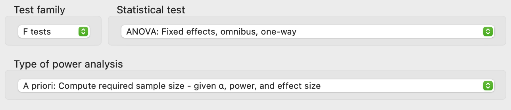
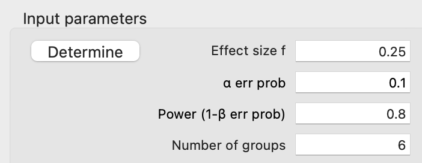
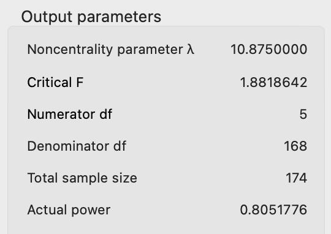
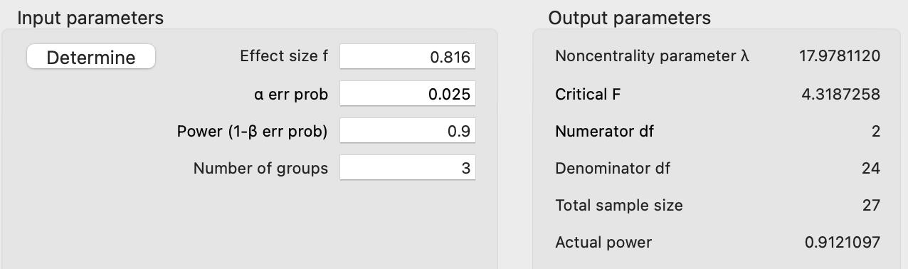
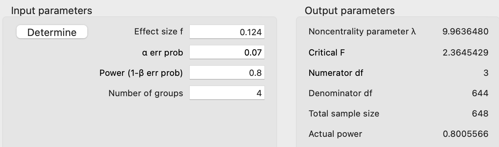
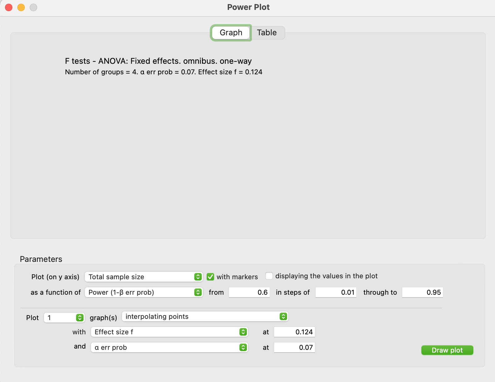
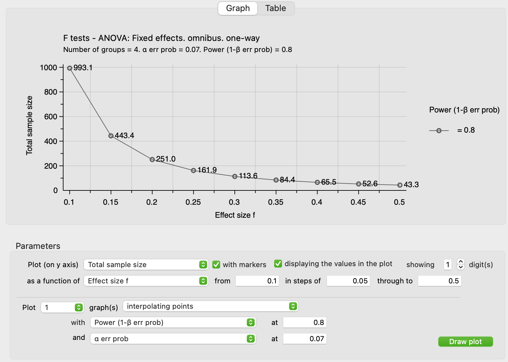
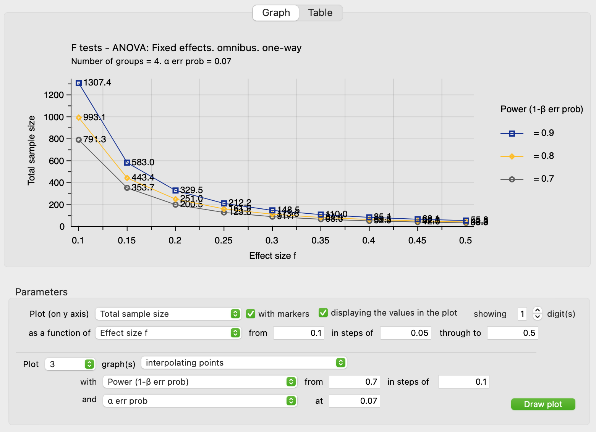
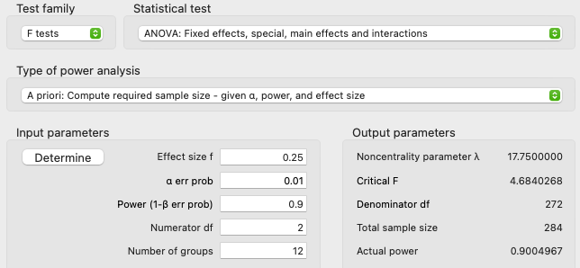

```{r setupFiles, echo=FALSE, include = FALSE}
# Setting Document Options
knitr::opts_chunk$set(
  echo = FALSE,
  warning = FALSE,
  message = FALSE,
  fig.align = "center"
)

packages <- c("tidyverse", "knitr", "kableExtra",
              "pwr", "WebPower")
lapply(packages, library, character.only = TRUE)

# Tell Knitr to use empty space instead of NA in printed tables
options(knitr.kable.NA = "")

```

In this tutorial, we are going to explore approaches to determining potential sample sizes for our study designs. We will be making use of software to assist us. Primarily, we'll look at G\*Power. I'll also talk about a couple approaches using some `R` packages.

# Key Components

In order to estimate the minimum sample size necessary, we need to specify four components: Type I risk, Type II risk (or power), the number of groups/treatments, and an effect size.

## Type I Risk

Recall that a Type I error is when we decide to reject a null hypothesis that is actually True. That is to say, the model specified as the "null" does a better job of describing our data than the alternative model. However, we've decided to reject the null model. We can think of this as a "False Positive". 

The risk of making a Type I error is typically represented by \(\mathcal{E}_{I}\) or \(\alpha\). Other names for Type I risk include "level of significance" and "Type I error rate".

Keep in mind that __you get to choose this value__ and you should do so before you see any results. Further, you should state what value you've chosen clearly. A common place do to this is at the end of your study design. Since we're talking about risk, we are talking about a probability, which means that you're limited to the interval \([0, 1]\). For our class, I'm going to impose further limitations: you may only select values from the interval \((0, 0.15]\). 

Later on in the course, we'll come back to the topic of Type I risk and speak more about ways to select our value.

## Type II Risk & Power

A Type II error occurs when we fail to reject a null hypothesis that is actually False. This is to say that the simpler model (i.e., the null model) does not do as good of a job as the alternative model to describe our data...but we decide to not discount the null model. We can think of this as a "False Negative".

The risk of making a Type II error is typically represented by \(\mathcal{E}_{II}\) or \(\beta\). Many times, researchers talk about __statistical power__, which is the complement of Type II risk, \(1-\mathcal{E}_{II}\). We can think of power as measuring our ability to detect how our data differ from the null model in the presence of variation.

This is another value that we get to pick. Generally, researchers aim for a power in the interval \([0.7,1)\). Ideally, we would like power to be 1 (i.e., \(\mathcal{E}_{II}=0\)), but we know that is unrealistic.

For our class, you will either be provided with a particular value, or you'll be able to choose from your own from the interval \([0.7,1)\). One of the most common values for power is 0.8.

## Number of Groups/Treatments

We also need to record the number of groups (for quasi-experiments and observational studies) or the number of treatments (for experiments). We often use *g* or *k* to represent this value.

Keep in mind that when there's only one factor, the number of levels of that factor will be the same as the number of groups/treatments. 

If you have multiple factors (or if you have factor(s) and a block), then the number of groups/treatments will be the product of the levels of all terms. (Remember, all factors and blocks will appear as nodes in the second level of a Hasse diagram.)

## Effect Size

The last component we need to specify is the effect size we're hoping to detect with our study. Effect size is a measure of the *practical significance* of our study and tends to deal with the magnitude of differences between treatment effects and/or how well our model (the alternative) does at explaining the variation in our data.

Both G\*Power and the `R` approaches I'll discuss make use of an effect called Cohen's _f_. The catch is that Cohen's _f_ isn't as popular as it once was. Newer effects sizes have become more popular. 

### Converting from \(\eta^2\)

One of the more popular effect sizes that we will be making use of is \(\eta^2\). We can interpret this as the proportion of the variation in the response values that our alternative model explains. 

We can convert to Cohen's _f_ with the following formula: \[f=\sqrt[2]{\frac{\eta^2}{1-\eta^2}}\]

### Converting from Minimum Difference of Interest

A second approach to effect size is to specify the minimum difference between any two treatments that we find interesting. Suppose that we set this minimum difference of interest to 5 units. We're basically saying that any difference that is in the interval \((-5,+5)\) is not worth our time and essentially the same thing as "no difference". 

We can convert any minimum difference of interest (_D_) to Cohen's _f_ with the following formula: \[f=\sqrt[2]{\frac{D^2}{2g\sigma^2}}\]
In this formula, we need to know the number of groups/treatments, _g_, and we need to know the error variance, \(\sigma^2\), for our response/model.

### When All Else Fails

Typically, we draw upon past studies or a particular desire/hunch for selecting the effect size. However, if we have no idea what to use, we can look at multiple effect sizes and make use of Cohen's suggested rules of thumb. Keep in mind that these rules of thumb are devoid of all context and __effect sizes are context dependent__.

+ Small Effect: \(f=0.1\)
+ Medium Effect: \(f=0.25\)
+ Large Effect: \(f=0.4\)

# Using G\*Power

G\*Power is a free application that helps researchers conduct sample size and power analyses. This application covers a wide array of designs and can help calculate effect sizes from data. 

To download and install G\*Power, visit their website https://www.psychologie.hhu.de/arbeitsgruppen/allgemeine-psychologie-und-arbeitspsychologie/gpower

There are two main ways you can use G\*Power: calculate a sample size and explore multiple sample sizes.

## Getting a Single Sample Size

This is the main usage of G\*Power and will __assume you want a balanced design__. You will need to have all four key components decided and at hand before you proceed.

### Step 1--Set the Test Family

In G\*Power, we need to set the test family to "F tests".
```{r testFamily, fig.cap="G*Power Test Family Setting"}
# Add picture of the test family setting in G*Power


```

### Step 2--Select the Statistical Test

Next we need to select the appropriate statistical test. For our class, we will be using the options that begin with ANOVA and ANCOVA. For right now, you'll want either

+ __Single Factor__ "ANOVA: Fixed effects, omnibus, one-way"
+ __Multiple Factors__ "ANOVA: Fixed effects, special, main effects and interactions"

### Step 3--Set Type of Power Analysis

We next need to specify the type of analysis we're after. Since we're trying to get an estimated sample size, we will want to select the option "A priori: Compute required sample size - given \(\alpha\), power, and effect size".

```{r gPowerSetup, fig.cap="Configuration of G*Power after Step 3", out.width="95%"}
# Add picture of the G*Power Configuration


```

### Step 4--Enter the Key Component Values

At this point in time, you need to enter the values for the four key components into their appropriate boxes.

+ "Effect size f" is Cohen's _f_
+ "\(\alpha\) err prob" is the Type I risk, \(\mathcal{E}_{I}\)
+ "Power (1-\(\beta\) err prob)" is Power, \(1-\mathcal{E}_{II}\)
+ Number of groups is the number of groups/treatments

Once you've entered these values, you just need to click the Calculate button to get the output.

## Examples

### Generic, One Factor Study

Let's start with a generic study were we know that we have six groups, a Type I risk of 0.1, a Type II risk of 0.2, and a medium effect size (\(f=025\)) for a single factor study. We would enter the values into G\*Power as shown in Figure \ref{fig:ex1Inputs}.

```{r ex1Inputs, fig.cap="G*Power inputs for first example", out.width="95%"}
# Add picture of the G*Power inputs for the first example


```

After clicking the Calculate button, we should get the outputs that appear in Figure \ref{fig:ex1Outputs}.

```{r ex1Outputs, fig.cap="G*Power Outputs for first example", out.width="80%"}
# Add picture of the G*Power outputs for the first example


```

The line that we most care about is the Total sample size line. This will tell us how many measurement units are needed to achieve the levels we set as the inputs. G\*Power aims for balanced designs everywhere possible. If you want to see how many measurement units you need in treatment _i_ (i.e., how many replicates you will have in each treatment), simply divide the total sample size by the number of groups/treatments, \(n_i = N/g\).

### Using \(\eta^2\)

Suppose that we're conducting an educational study on the impact of three different strategies on students' abilities to recall basic multiplication facts. The strategies consistent of Mad Mintues, flash cards, and studying multiplication fact families. 

In past work, we found that approximately 40% of the variation in students' performance scores related to basic arithmetic could be attributed to the educational strategies used. That is to say, we have \(\eta^2=0.4\).

We want to design a study to see if we can find similar or larger effects for multiplication. We want relatively low Type I risk (\(\mathcal{E}_{I}=0.025\)) and high power (\(1-\mathcal{E}_{II}=0.9\)). Since we have three treatments, we will have three groups. 

The last component we need is Cohen's _f_. Since we know that past studies have been able to explain 40% of the variation in scores, this seems like a reasonable effect size to make use of. However, we need to convert:  \[f=\sqrt[2]{\frac{0.4}{1-0.4}}=\sqrt[2]{\frac{0.4}{0.6}}=\sqrt[2]{2/3}\approx 0.816\]

We now have everything we need to enter into G\*Power.

```{r ex2InsOuts, fig.cap="G*Power Inputs and Outputs for second example", out.width="90%"}
# Add picture for th G*Power window for second example


```

We would need a total of 27 students (9 in each treatment). This is the fewest number of students we would need given our choices of Type I and Type II risk to observe an effect size at least as big as 40% variation explained.

### Using Minimum Difference of Interest

Suppose that we're wanting to test out three new fertilizers meant to increase yield for corn crops. (We will also compare with no fertilizers at all.) The costs associated with the fertilizers and the differences between them are such that if they do not increase the yield by at least 2 bushels per acre, the farmer will lose money. From past work (studies), we have a sense of the error variation being around 32.4 bpa-squared.

This situation highlights that we have a minimum difference of interest (2 bushels per acre). We might choose a Type I risk of 7% (\(\mathcal{E}_{I}=0.07\)) and a power of 0.8. Here we'll say that there are 4 groups total (3 new fertilizers plus no fertilizer). All that's left is to convert the minimum difference of interest, _D_, to Cohen's _f_.

\[f=\sqrt[2]{\frac{2^2}{2*4*32.4}}=\sqrt[2]{\frac{4}{259.2}}=\sqrt[2]{0.0154}\approx 0.124\]

```{r ex3InsOuts, fig.cap="G*Power Inputs and Outputs for third example", out.width="90%"}
# Add picture of G*Power window for third example


```

From Figure \ref{fig:ex3InsOuts}, we can see that our total sample size is 648 measurement units. That's a lot of fields or even portions of fields that we have to cover.

## Exploring With G\*Power

There's a second side to G\*Power that is more exploratory in nature. This can let you see some potential tradeoffs by looking at a variety of potential values for the key components. To engage in the exploration, you need to press the plot button for G\*Power in Figure \ref{fig:plotButton}.

```{r plotButton, fig.cap="G*Power Plot Button", out.width="90%"}
# Add picture of the plot button in G*Power


```

When you do, G\*Power will bring over your last set of inputs and will give you a window similar to Figure \ref{fig:plotStart}.

```{r plotStart, fig.cap="G*Power Plot Window", out.width="60%", fig.pos="H"}
# Add picture of G*Power's initial plotting window


```

Given the large sample size of the corn yield example, let's explore what happens if we allow our effect size to vary from 0.1 to 0.5 in steps of 0.05.

```{r plotEffectSize, fig.cap="Sample Size by Effect Size, given fixed risks", out.width="80%"}
# Add first example G*Power plot with Effect size


```

Figure \ref{fig:plotEffectSize} shows us the plotting inputs ("Parameter") and the resulting plot.

In the Parameters section, I placed total sample size on the vertical (y) axis and placed effect size on the horizontal (x) axis. I went ahead and checked the options for markers (draw points along the curve) and to label those points with values to 1 digit (no need to go further than that). For the horizontal axis, you can specify a lower and upper bound along with a step size. Here I used 0.1 as my smallest effect size and 0.5 as my largest effect size. I had G\*Power step by 0.05 for placing the points/markers. In the second (lower) portion of Parameters, you'll find power and Type I risk. These are the fixed at the values we had originally set for power and Type I risk.

The graph shows us the interplay of effect size and total sample size. The smaller the effect size we're hoping to detect, the more measurement units we need. The larger the effect size, the fewer measurement units needed. Notice that there is not a linear relationship between these two aspects. 

In the case of our fertilizer study, we might decide to increase our minimum difference of interest so that we can have a more reasonable sample size. For example, moving up to \(f=0.2\) would yield a minimum difference of approximately 3.2 bushels per acre (\(\sqrt[2]{0.2^2\left(2\cdot 4\cdot 32.4\right)}\approx 3.2199\)). This would shift our total sample size from 648 to 252 (the next closest sample size divisible by four for a balanced design). 

We can continue to explore by altering the plot field in the lower portion of the Parameters section. Figure \ref{fig:plotMultiplePowers} shows that we can graph several curves for various powers. In this case, I've added curves for powers of 0.7, 0.8, and 0.9.

```{r plotMultiplePowers, fig.cap="Total Sample Size by Effect Size and Power", out.width="80%"}
# Add G*Power plot with multiple curves


```

The graph generated by G\*Power (and the associated table view) provides a way for you to consider trade offs between the four key components and sample size. This can help you better think about real-world constraints that you might face.

# Using `R`

This section is really only for individuals who wish to explore doing sample size considerations in R rather than G\*Power. I only came across these packages after we started the course, hence I was already set up for using G\*Power. 

## The `stats` Package Method

One of the base packages of `R` is the `stats` package which is automatically loaded each time you start `R`. The function that you call is `power.anova.test`. To use this function to get _sample sizes for each group_, 

```{r statsMethodDetails, eval=FALSE, echo=TRUE}
# Details for power.anova.test function
power.anova.test(
  groups = g, # how many groups/treatments your design has
  sig.level = EI, # Type I Risk
  power = 1 - EII, # Power = 1 - Type II Risk
  between.var = Var(trt), # Variance of Treatment Effects
  within.var = Var(err) # Error variance
)

```

Notice that in this formation we don't give Cohen's _f_. Rather we give two variance components which `R` will convert for us into an effect size. 

Let's come back to the example of strategies for multiplication facts. I've replaced our knowledge about effect size (via \(\eta^2\)) with values for the variance components that would *roughly* yield the same effect size.

```{r statsMethodExample, eval=TRUE, echo=TRUE}
# Using power.anova.test on multiplication facts example
power.anova.test(
  groups = 3, 
  sig.level = 0.025, 
  power = 0.9, 
  between.var = 13,
  within.var = 19.5
)

```

From the output of `power.anova.test` we can get a value for _n_, the sample size per treatment/group. Notice that this value doesn't quite match up with what G\*Power suggests; \(N=27\) implying that \(n=9\). Here, the suggestion is that \(n=13\). I do not know the cause for the discrepancy.

## The `pwr` Package

A second route is to use the `pwr` package. You will need to first install this package and then load the package.

```{r installPwr, echo=TRUE, eval=FALSE}
# Installing the pwr package
install.packages("pwr")

# load the package
library(pwr)
```

The `pwr` package has many of the same functions as G\*Power. The one that we would want to use is `pwr.anova.test`. While the format is similar to `stats:power.anova.test`, we do get to use Cohen's _f_ instead of two variance components.

```{r pwrMethodDetails, eval=FALSE, echo=TRUE}
# Details of the pwr.anova.test function
pwr::pwr.anova.test(
  k = g, # how many groups/treatments your design has
  sig.level = EI, # Type I Risk
  power = 1 - EII, # Power = 1 - Type II Risk
  f = f # Cohen's f effect size
)

```

Let's use the multiplication facts example again with `pwr.anova.test`

```{r pwrMethodExample, eval=TRUE, echo=TRUE}
# Using pwr.anova.test on the multiplication facts example
pwr::pwr.anova.test(
  k = 3, 
  sig.level = 0.025, 
  power = 0.9, 
  f = 0.816
)

```

Notice that the output here is again in terms of the group/treatment sample size, _n_, rather than total sample size _N_. However, we can see that we have agreement between `pwr` and G\*Power: 9 measurement units per treatment--27 measurement units total.

## The `WebPower` Package

Another route is to use the `WebPower` package. Again, you will need to first install this package and then load the package.

```{r installWebPower, echo=TRUE, eval=FALSE}
# Installing the WebPower package
install.packages("WebPower")

# load the package
library(WebPower)
```

The major difference between `WebPower` and `pwr` is that `WebPower` has a few more models/designs built in. The key functions here are `wp.anova` (for one-way designs) and `wp.kanova` (for more advanced designs).

```{r wpMethodDetails1, eval=FALSE, echo=TRUE}
# Details of the wp.anova function
WebPower::wp.anova(
  k = g, # how many groups/treatments your design has
  alpha = EI, # Type I Risk
  power = 1 - EII, # Power = 1 - Type II Risk
  f = f, # Cohen's f effect size
  type = "overall" # Nuance for alternative hypothesis
)

```

Again, let's use the multiplication fact example:

```{r wpMethodExample1, eval=TRUE, echo=TRUE}
# Using wp.anova on the multiplication facts example
WebPower::wp.anova(
  k = 3, 
  alpha = 0.025, 
  power = 0.9, 
  f = 0.816, 
  type = "overall" 
)

```

Notice that `WebPower`'s output is in terms of total sample size, _N_. 

For more complicated ANOVA models (e.g., blocks, factorial, etc.), we would want to use `wp.kanova`:

```{r wpMethodDetails2, eval=FALSE, echo=TRUE}
# Details of the wp.kanova function
WebPower::wp.kanova(
  ng = g, # Number of groups (across all blocks and treatments)
  ndf = d, # Degrees of freedom for primary factor
  alpha = EI, # Type I Risk
  power = 1 - EII, # Power = 1 - Type II Risk
  f = f # Cohen's f effect size
)

```

### Example with `wp.kanvoa`

Suppose that we have an interest in the impact of three different drugs on patient recovery, when we account for what type of hospital unit they are in (four possible). In this study, we're not interested in the effect of hospital unit per se, but we don't want this to become confounded with the effect of the drugs. Thus, we would treat hospital unit as a block. Let's use \(\mathcal{E}_{I}=0.01\), \(1-\mathcal{E}_{II}=0.95\), and a medium effect size, \(f=0.25\). We will have two degrees of freedom for our factor and we'll have 12 groups across all factor levels and blocks.

```{r wpMethodExample2, eval=TRUE, echo=TRUE}
# Using wp.kanova on the hospital units block example
WebPower::wp.kanova(
  ng = 12, 
  ndf = 2, 
  alpha = 0.01, 
  power = 0.9,
  f = 0.25
)

```

```{r example4, fig.cap="G*Power Inputs and Outputs for Hospital Block Design", out.width="90%"}
# Add image of G*Power approach to the hospital units block example


```

Notice that the outputs of `wp.kanova` and G\*Power (Figure \ref{fig:example4}) are in agreement. Additionally, if you look at Figure \ref{fig:example4} you can see that we can do this same analysis in G\*Power by changing the Statistical test option to "ANOVA: Fixed effects, special, main effects and interactions".

\newpage

# Code Appendix

```{r codeAppendix, ref.label = knitr::all_labels(), echo = TRUE, eval = FALSE}

```