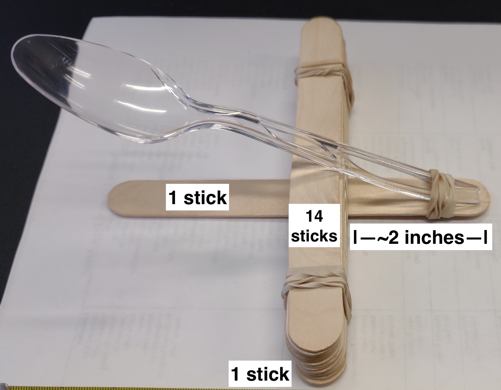
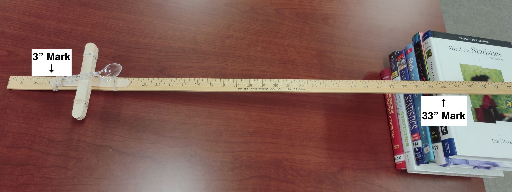

<!--IMPORTANT NOTE: 
To ensure that you can knit this RMD file on your local machine, you'll need to ensure that you have all additional files saved to the same directory/folder as this RMD. The additional files are spoonapult.jpg, finalSetup.jpg, references.bib, and american-statistical-association.csl

These file may be found on GitHub for download at https://github.com/neilhatfield/STAT461/tree/master/writingReports
--->

```{r setup, include=FALSE}
# Setting Document Options ----
knitr::opts_chunk$set(
  echo = FALSE,
  warning = FALSE,
  message = FALSE,
  fig.align = "center"
)

# Load Packages ----
packages <- c("tidyverse", "knitr", "kableExtra",
              "parameters", "hasseDiagram", "car",
              "psych", "DescTools", "emmeans", "openxlsx")
invisible(lapply(X = packages, FUN = library, character.only = TRUE, quietly = TRUE))

# Setting Global Options ----
options(knitr.kable.NA = "")
options("contrasts" = c("contr.sum", "contr.poly"))

# Load Additional Tools ----
source("https://raw.github.com/neilhatfield/STAT461/master/rScripts/ANOVATools.R")
source("https://raw.github.com/neilhatfield/STAT461/master/rScripts/shadowgram.R")

```

# Executive Summary

To explore the impacts of launch angle and position on how far a simple catapult could fling a gummy bear, the Fall 2022 STAT 461 course under the guidance of Dr. Hatfield, designed and conducted an experiment. Using two different levels for position (front/back of the platform/ramp) and three different levels for launch angle (flat, low, or high), the class found that the main effect of launch angle as well as the interaction of angle and position had statistical significant impacts on how far the gummy bear flew. Additional post hoc analysis revealed that when launching from the front of the platform/ramp there was little difference due to launch angle. However, when launching from the back, the low launch angle performed better than flat and high. Among the treatment extremes, the high angle-front position out performed the flat angle-back position in terms of how far the gummy bear flew. We discuss several limitations and offer suggestions for addressing them.

# Introduction and Background

Requiring students to put into practice the lessons they have been learning is a powerful way to help them internalize otherwise abstract concepts. Additionally, getting students to wrestle with how to come up with an approach to answer a research question provides an opportunity for students to authentically engage in the scientific process [@artigue2020; @artigue2013; @prodromou2019; @metz2008; @laursen2014]. These ideas are what underpin Dr. Hatfield's approach in the Fall 2022 STAT 461 course.

For this particular sequence of activities, Dr. Hatfield drew upon the "Gummy Bears in Space" activity [@cobb1996a]. The sequence of activities involved students creating initial study designs, refining and synthesizing a single study design, and carrying out the experiment. Additional class activities included looking at data visualizations to decide whether the assumptions of the parametric shortcut were satisfied. This report provides a template that student may draw upon for their own report.

## Research Questions

For this particular study, we have several research questions:

1) Does the launch angle make a difference on how far a gummy bear flew?
    - \(H_{1,0}\): There is no statistically significant impact on how far a gummy bear flies due to launch angle.
    - \(H_{1,A}\): There is a statistically significant impact on how far a gummy bear flies due to launch angle.
2) Does the launch position make a difference on how far a gummy bear flew?
    - \(H_{2,0}\): There is no statistically significant impact on how far a gummy bear flies due to launch position.
    - \(H_{2,A}\): There is a statistically significant impact on how far a gummy bear flies due to launch position.
3) Does the interaction of launch angle and position make a difference on how far a gummy bear flew?
    - \(H_{3,0}\): There is no statistically significant interaction effect on how far a gummy bear flies between launch angle and position.
    - \(H_{3,A}\): There is a statistically significant interaction effect on how far a gummy bear flies between launch angle and position.

Should we find significant impacts, we will also explore the following research questions:

+ Given launch position, what launch angle appears to send the gummy bear the furthest?
- Is there a significant difference between the two treatment extremes? That is, are flat-front and high-back significantly different? And the reverse (flat-back vs. high-front)?

# Methods

To answer these research questions, we designed an experiment to explore the impacts of launch position and launch angle on how far a gummy bear gets flung by a simple catapult. By using an experiment, we are able to make statements about the potential causality, which we would be unable to do in a quasi-experiment or observational study.

## The Experiment

```{r spoonapult}
#| fig.cap = "A Spoonapult",
#| out.width = "40%",
#| fig.pos = "H"

# Import picture of the spoonapult ----


```

```{r readData}
# Read in Data from Git Hub Repo ----
catapultData <- openxlsx::readWorkbook(
  xlsxFile = "https://raw.github.com/neilhatfield/STAT461/master/dataFiles/gummyBears_Fall2022.xlsx",
  sheet = 1,
  colNames = TRUE,
  rowNames = FALSE
)

# Set the Factors ----
catapultData$angle <- factor(
  x = catapultData$angle,
  levels = c("flat", "low", "high") # Setting a specific order to levels
)
catapultData$position <- as.factor(catapultData$position) 

# Using "factor" to set order of groups ----
catapultData$experimentalUnit <- factor(
  x = catapultData$experimentalUnit,
  levels = c("Grp 1", "Grp 2", "Grp 3", "Grp 4",
             "Grp 5", "Grp 6", "Grp 7", "Grp 8",
             "Grp 9", "Grp 10", "Grp 11", "Grp 12")
)

```

To carry out our study, we made use of a simple catapult made out of craft sticks, rubber bands, and plastic spoon--otherwise known as a "spoonapult" (see Figure \ref{fig:spoonapult}). While each team created their own spoonapult, they constructed them in the same way with Dr. Hatfield monitoring their construction. Dr. Hatfield used R's sample function to randomly assign each team one of the six treatments (establishing two replicates). The treatments consisted of a launch position and a launch angle. For position, groups were either at the front (3-inch mark) or back (33-inch mark) of a meter stick. For launch angle, groups were either flat (meter stick laying on flat the floor), low with the meter stick propped up on one end by one book, or "high" with the meter stick propped up by a stack of five books. All low groups used copies of the same book; all high groups used stacks of the same five books. When groups used any books, the 33-inch mark of the meter stick was placed inline with the spines of the books. Figure \ref{fig:catapultSetup} shows an approximation of a Front-High set up with the caveat that the stack of books shown contains an extra book.

```{r catapultSetup}
#| fig.cap = "Example Setup for a Front-High",
#| out.width = "75%",
#| fig.pos = "H"

# Import picture of a completed set up ----


```

The class decided that each group should use five gummy bears as practice runs to get down their process. The class voted to measure from directly below the bowl of each spoon to where the gummy bear came to rest in centimeters. Once they had completed their practice shots, they then measured the distances of twenty gummy bears. (The gummy bears were selected via cluster sampling from a randomly selected bag of gummy bears.) Each group recorded their own data and submitted their data files to Dr. Hatfield. Dr. Hatfield then merged the data files into one [@hatfield2022]. Data are freely available on Dr. Hatfield's [GitHub repository](https://github.com/neilhatfield/STAT461/blob/master/dataFiles/gummyBears_Fall2022.xlsx) for STAT 461.

We will note here that we've used individual gummy bears as measurement units while the twelve groups as experimental units. Dr. Hatfield chose this set up to minimize the risk that each team might introduce confounding by having to switch (or not) their catapult setups for each individual gummy bear.

## Analytical Methods

To analyze our data and answer our research questions we will use R (version 4.2.1) and make use of ANOVA methods, in particular a full factorial (two-way) ANOVA model.

### Appropriateness of ANOVA

Given that our response of interest is how far a gummy bear traveled when flung by a spoonapult (in centimeters), we have a continuous response. Additionally, we have two factors of interest: the launch position and launch angle--flat, low, or high. Launch position is categorical with two levels (front or back). While launch angle could be quantified, we used stacks of books to induce angle and thus, we will treat this factor categorically as well with three levels (flat, low, or high).

```{r hasseDiagram}
#| fig.cap = "Hasse Diagram for the Gummy Bear Study",
#| fig.height = 3

# Create a Hasse diagram for the study ----
modelLabels <- c("1 Launch 1", "2 Position 1", "3 Angle 2",
                 "6 Position × Angle 2", "240 (Gummy Bears) 234")
modelMatrix <- matrix(
  data = c(FALSE, FALSE, FALSE, FALSE, FALSE, TRUE,
           FALSE, FALSE, FALSE, FALSE, TRUE, FALSE,
           FALSE, FALSE, FALSE, TRUE, TRUE, TRUE,
           FALSE, FALSE, TRUE, TRUE, TRUE, TRUE, FALSE),
  nrow = 5,
  ncol = 5,
  byrow = FALSE
)
hasseDiagram::hasse(
 data = modelMatrix,
 labels = modelLabels
)

```

Figure \ref{fig:hasseDiagram} shows the Hasse diagram for our study. We can see our two factors (fixed effects) as well as their interaction. Further, given our sample size of `r nrow(catapultData)` gummy bears, we have plenty of *degrees of freedom* to estimate all main effects, interactions, and error terms. These elements point towards the appropriateness of ANOVA methods in answering our research questions. In particular, we will make use of a two-way ANOVA model (see Equation \ref{eq:model}). This ANOVA model is the most appropriate as we have two factors of interest and want to also explore whether there is an interaction between them. This is more appropriate than a one-way model as we can distinguish between the main effects and interaction terms. Further, we are manipulating our two categorical attributes, thus neither of them are inherent attributes of our measurement units (i.e., we can't use them as a block).

```{=tex}
\begin{equation} \label{eq:model}
Y_{ijk}=\mu_{\cdot\cdot\cdot}+\alpha_{i} + \beta_{j} + \alpha\beta_{ij} + \epsilon_{ijk}
\end{equation}
```
Equation \ref{eq:model} and Figure \ref{fig:hasseDiagram} both represent the underlying fixed-effects, two-way ANOVA model for our study. In particular, the \(\mu_{\cdot\cdot\cdot}\) represents the baseline effect of using a spoonapult to launch a gummy bear, \(\alpha_i\) represents the main effect of launch position, \(\beta_j\) represents the main effect of launch angle, and \(\alpha\beta_{ij}\) the interaction of position and angle. Our residual/error term (\(\epsilon_{ijk}\)) represents the inherent variability present within the individual gummy bears as well as any other sources not accounted for in our model.

### Addressing the Multiple Comparisons Problem

To account for the fact that we are conducting multiple tests of statistical significance, we will construct several testing families for our work. Our three omnibus tests (main effects and the interaction) will comprise of one family. We will break the subsequent set of research questions (i.e., the post hoc questions) into two additional testing families: one for the conditional means and one for the contrast questions. For each testing family, we will control our False Discovery Rate at a level of 6%, using the Benjamini-Hochberg method. Within each hypothesis test, we will use an Unusualness Threshold equivalent to 0.06.

# Exploratory Data Analysis

```{r descpStats}
# Produce values of descriptive statistics ----
descpStats <- psych::describeBy(
  distance ~ angle + position, 
  data = catapultData,
  na.rm = TRUE,
  skew = TRUE,
  ranges = TRUE,
  quant = c(0.25, 0.75),
  IQR = TRUE,
  mat = TRUE,
  digits = 4
)

# Create a table of values ----
descpStats %>%
  tibble::remove_rownames() %>%
  dplyr::select(
    group1, group2, n, min, Q0.25, median, Q0.75, max, mad, mean, sd, skew, kurtosis
  ) %>%
  knitr::kable(
    caption = "Summary Statistics for the Gummy Bear Distances",
    digits = 2,
    format.args = list(big.mark = ","),
    align = rep(c("l", "c"), times = c(2, 11)),
    col.names = c("Angle", "Position", "n", "Min", "Q1", "Median", "Q3", "Max", "MAD",
                  "SAM", "SASD", "Sample Skew", "Sample Ex. Kurtosis"),
    booktabs = TRUE
  )  %>%
  kableExtra::kable_styling(
    font_size = 12,
    latex_options = c("HOLD_position", "scale_down")
  ) 

```

Table \ref{tab:descpStats} shows the values for various statistics broken out by the six treatments. We can see that we have a balanced design (via the "n" column), which will provide us with benefits in terms of assumptions and *sums of squares* partitioning later on. There are a few aspects that jump out at us. Fist, The flat-back and high-back conditions have two values for the *Sample Minimum* which are an order of magnitude less than the other treatments. Their other values along Tukey's five-number summary appear to be inline with the other treatment groups. This might suggest that at least two groups might have had issues with launching gummy bears. The low-back condition also stands out in that this group quickly exceeds the other groups' distances starting with the value of the first quartile.

If we wanted to explore the amount of variation within the treatment groups, we can turn towards two statistics: the *Median Absolute Deviation* (*MAD*) and the *Sample Arithmetic Standard Deviation* (*SASD*). The value of the *MAD* is the distance that half of all of the observations are from the value of the *Sample Median* and is a fairly robust and resistant estimator of the population standard deviation (\(\sigma\)). The *SASD* provides a unit-adjusted measure of amount of distance between pairs of observations within a collection, providing slightly biased, non-resistant estimator of the population standard deviation. Looking across the values of the *MAD*, we see relatively comparable values for the six treatments. When we do the same for the values of the *SASD*, we see two groupings that appear dependent upon launch position.

```{r boxplots}
#| fig.cap = "Box Plots of Gummy Bear Distances",
#| fig.height = 2.75,
#| fig.pos = "H"

# Create side-by-side box plots of the distances ----
ggplot(
  data = catapultData,
  mapping = aes(
    x = angle,
    y = distance,
    fill = position
  )
) +
  geom_boxplot() +
  theme_bw() +
  xlab("Launch Angle") +
  ylab("Distance (cm)") +
  labs(
    fill = "Launch Position"
  ) +
  theme(
    legend.position = "bottom",
    text = element_text(size = 12)
  ) +
  scale_fill_manual(
    values = boastUtils::boastPalette
  )

```

Figure \ref{fig:boxplots} shows the box plots of the six treatment groups. The two extreme values of the *Sample Minimum* do not appear to show up as potential outliers in accordance to the 1.5-*IQR* rule (they would appear as dots in the plot if they did). We can see that the low-back group appears to out-perform all of the other groups. Additionally, we can better see that the three treatment involving the front position perform relatively the same.

If there were strong impacts due to the treatment groups, then we would expect to see six distinct modal clumps in a shadowgram of our response. Figure \ref{fig:shadowgram} provides a shadowgram of our data. As a reminder, we're looking not at the peaks but at dark portions formed by overlapping shadows. In essence, we do not see six modal clumps, but rather one. This suggests that if there are effects due to position and/or angle, they might be weak and/or there is enough noise in our data to obscure the effects.

```{r shadowgram}
#| fig.cap = "Shadowgram of Distances",
#| fig.pos = "H",
#| fig.height = 2.75

# Create a shadowgram of the distances ----
shadowgram(
  dataVec = catapultData$distance,
  label = "Distance (cm)",
  layers = 70,
  aStep = 7,
  color = "blue"
)

```

```{r interactionPlot}
#| fig.cap = "Interaction Plot for Gummy Bear Study",
#| fig.pos = "H",
#| fig.height = 2.75

# Create an interaction plot ----
ggplot(
  data = catapultData,
  mapping = aes(
    x = angle,
    y = distance,
    shape = position,
    color = position,
    linetype = position,
    group = position
  )
) +
  stat_summary(fun = "mean", geom = "point", size = 3) +
  stat_summary(fun = "mean", geom = "line", linewidth = 1) +
  geom_jitter(width = 0.1, height = 0.1, alpha = 0.5, size = 1) +
  ggplot2::theme_bw() +
  xlab("Launch Angle") +
  ylab("Distance (cm)") +
  labs(
    color = "Launch Position",
    shape = "Launch Position",
    linetype = "Launch Position"
  ) +
  scale_color_manual(values = boastUtils::boastPalette) +
  theme(
    legend.position = "bottom",
    text = element_text(size = 12)
  )

```

Figure \ref{fig:interactionPlot} shows two sets of information about our data. First, in the background is a scatter plot of our `r nrow(catapultData)` gummy bears, plotted by launch angle and position. This scatter plot shows the relatively large amount of overlap in the distances traveled by the gummy bears across the various levels of launch angle and position. The second set of information are the trend lines in the foreground, connecting the values of the *Sample Arithmetic Means*. This allows us to explore the presence of any interaction between our two factors. Given that we observe non-parallel lines, this suggests that we have observed an interaction between our two factors.

# Results

We present our results in three sections. First, we will discuss the assumptions of the parametric shortcut. Then we will move on to answering our omnibus questions before ending this section with post hoc analysis, if appropriate.

## Assumptions

Ideally, we would like to make use of the parametric shortcut for our hypothesis tests. Parametric approaches have greater power than other methods, when their assumptions are met. For the parametric shortcut for a two-way ANOVA model, we need to satisfy three assumptions: our model residuals need to follow a Gaussian distribution, we need homoscedasticity (around the model), and we need independent observations. If any of these assumptions are violated, then our inference results will not be trustworthy and we no longer have the power that we might have wanted.

```{r fitModel}
# Fit the two-way ANOVA model ----
catapultModel <- aov(
  formula = distance ~ angle*position,
  data = catapultData
)

```

```{r qqPlot}
#| fig.cap = "QQ Plot for Gummy Bear Study",
#| fig.pos = "H"

# Generate the qq plot ----
car::qqPlot(
  x = residuals(catapultModel), 
  distribution = "norm",
  envelope = 0.90,
  id = FALSE,
  pch = 20,
  ylab = "Residuals (cm)"
)

```

The first assumption we'll discuss is that of our model residuals (i.e., \(\epsilon_{ijk}\)) following a Gaussian ("normal") distribution. Figure \ref{fig:qqPlot} shows the quantile-quantile (QQ) plot of our residuals against a Gaussian distribution. We've included a 90% confidence envelope to help identify points which might stray too far from the reference line of perfect fit. None of our points lie outside of this envelope. Additionally, from Table \ref{tab:descpStats}, we can see that our values of *Sample Skewness* and *Sample Excess Kurtosis* are not overly far from what we would anticipate for a Gaussian distribution (zero for both). The slightly negative values for *Sample Excess Kurtosis* indicate that we've observed fewer potential outliers than we would anticipate a true Gaussian distribution to produce. The values for *Sample Skewness* raise a slight caution for us. While all of the them are close to zero, two treatment groups have positive values (flat-back and low-front) while the others have negative values. While we generally want all groups to skew in the same direction (if they are going to be skewed), the relatively small magnitudes here help to ameliorate our concern.

```{r tukeyAnscombe}
#| fig.cap = "Tukey-Anscombe Plot for Gummy Bears Study",
#| fig.pos = "H",
#| fig.height = 3

# Generate the Tukey-Anscombe plot ----
ggplot(
  data = data.frame(
    residuals = residuals(catapultModel),
    fitted = fitted.values(catapultModel)
  ),
  mapping = aes(x = fitted, y = residuals)
) +
  geom_point(size = 2) +
  geom_hline(
    yintercept = 0,
    linetype = "dashed",
    color = "grey50"
  ) +
  geom_smooth(
    formula = y ~ x,
    method = stats::loess,
    method.args = list(degree = 1),
    se = FALSE,
    linewidth = 0.5
  ) +
  theme_bw() +
  xlab("Fitted values (cm)") +
  ylab("Residuals (cm)")

```

To assess whether we have homoscedasticity around our model, we'll turn to the Tukey-Anscombe plot shown in Figure \ref{fig:tukeyAnscombe}. As we look across the plot, we want to assess whether there is a pattern that relates the fitted value to the residuals. The blue smooth line indicates that there is not such a pattern. Further, as we look at the the six strips, we can see that none of them contain more than twice the vertical space of another. We take both of these as evidence in favor of homoscedasticity.

The most important of the three assumptions is the independence of observations. While we have measurement order, we only have that measurement order within the twelve groups. From our study design and implementation, the twelve groups worked separately from each other, with minimal interference. This points to our experimental units (i.e., the groups) being independent.

Within each team, we can explore the index plots shown in Figure \ref{fig:indexPlots}. For these index plots, we've added a linear trend line with a 90% confidence interval (blue lines with grey regions). In an ideal experiment, we should see perfectly horizontal trend lines. This would reflect groups working in a memoryless environment, which is not possible with human beings. Thus, we can anticipate some deviation from the ideal setting. A positive trend would indicate that the spoonapult operator was improving over time while a negative trend would indicate fatigue or worsening performance. To assess the human impact, we've also plotted the generalized performance of each group via the *Sample Arithmetic Mean* as a dashed red line. If the dashed line falls within the confidence interval, then we will take the appearance of a trend between measurement order and distance to be statistically insignificant. From Figure \ref{fig:indexPlots}, we see that groups 2, 3, 5, 6, 9, 10, and 11 are clearly within the intervals. Groups 1, 7, and 12 have the dashed lines on the edges of the intervals. Of these, Groups 1 and 12 show potential evidence of improving while Group 7 might be showing fatigue. Groups 4 and 8 have their dashed lines beyond the intervals and both show signs of worsening performance. This could be the result of fatigue, rushing to finish, or some other cause.

```{r indexPlots}
#| fig.cap = "Index Plots Within Groups",
#| fig.pos = "H"

# Create new data frame ---
means <- catapultData %>%
  group_by(experimentalUnit) %>%
  summarize(
    sam = mean(distance, na.rm = TRUE)
  )

catData2 <- left_join(
  x = catapultData,
  y = means,
  by = c("experimentalUnit" = "experimentalUnit")
)

# Create the Index Plot by Group/Team ----
ggplot(
  data = catData2,
  mapping = aes(
    x = order,
    y = distance
  )
) +
  geom_point(size = 0.5) +
  geom_line() +
  geom_smooth(
    formula = y ~ x,
    method = "lm",
    se = TRUE,
    level = 0.9,
    linetype = 1
  ) +
  geom_line(
    data = catData2,
    mapping = aes(y = sam, x = order),
    linetype = 2,
    color = "red"
  ) +
  theme_bw() +
  xlab("Measurement order") +
  ylab("Distance (cm)") +
  facet_wrap(
    facets = vars(experimentalUnit),
    scales = "fixed"
  ) 
```

Taking our three assessments together, we will decide to proceed cautiously with the parametric shortcut. While our experimental units were independent of one another, we might have some issues with the independence of measurement units within certain groups.

## Omnibus 

Table \ref{tab:anovaTable} shows the ANOVA table for our two-way ANOVA model, using the parametric shortcut. For our three omnibus research questions, we will focus on the first three rows. The main effect of launch angle accounts for approximately `r round(anova(catapultModel)$"F value"[1], digits = 1)` times as much variation as our residuals. In a similar vein, the main effect of launch position accounts for `r round(anova(catapultModel)$"F value"[2], digits = 1)` times as much variation. The interaction of angle and position accounts for nearly `r round(anova(catapultModel)$"F value"[3], digits = 1)` times as much variation as what is left unexplained by our model. Under their respective null hypotheses, we would only anticipate observing such extreme values for the *F* ratio less than 1 ten-thousandths of the time for the main effect of angle and the interaction. For launch position, we would anticipate observing a *F*-ratio at least as large as `r round(anova(catapultModel)$"F value"[2], digits = 1)` around `r paste0(round(anova(catapultModel)$"Pr(>F)"[2], digits = 2) * 100, "%")` of the time. Of these, launch angle and the interaction term appear to have statistical significance (*p*-values less than our Unusualness Threshold of 0.06), both which appear to have a large effect size in explaining around 13% and 12% of the variation in the distance the gummy bears traveled, respectively.

```{r anovaTable}
# Omnibus Test/Modern ANOVA Table ----
parameters::model_parameters(
  model = catapultModel,
  effectsize_type = c("eta", "omega", "epsilon"),
  type = 3, 
  drop = "(Intercept)",
  verbose = FALSE 
) %>%
  dplyr::mutate(
    p = ifelse(
      test = is.na(p),
      yes = NA,
      no = pvalRound(p)
    )
  ) %>%
  knitr::kable(
    digits = 4,
    format.args = list(big.mark = ","),
    row.names = FALSE,
    col.names = c("Source", "SS", "df", "MS", "F", "p-value",
                  "Partial Omega Sq.", "Partial Eta Sq.", "Partial Epsilon Sq."),
    caption = "ANOVA Table for Gummy Bears Study",
    align = c('l',rep('c',8)),
    booktab = TRUE
  ) %>%
  kableExtra::kable_styling(
    bootstrap_options = c("striped", "condensed"),
    font_size = 12,
    latex_options = c("scale_down", "HOLD_position")
  )

```

## Post Hoc

Given that we have statistically significant impacts of the main effect of launch angle and the interaction of launch angle and position, we will use the full hierarchical model to explore our post hoc analysis questions. As a reminder, we have the following questions:

+ Given launch position, what launch angle appears to send the gummy bear the furthest?
+ Is there a significant difference between the two treatment extremes? That is, are flat-front and high-back significantly different? And the reverse (flat-back vs. high-front)?

We will break these into two testing families, still controlling FDR at 0.06. The first will focus on the conditional comparisons of launch angle. The second will focus on comparing treatment extremes.

### Comparing Launch Angles Given Position

```{r anglePosition}
# Get the marginal means of angle conditioned by position ----
angleGivenPosition <- emmeans::emmeans(
  object = catapultModel,
  specs = pairwise ~ angle | position,
  adjust = "BH", 
  level = 0.9 
)

# Clarify the p-values and make nice looking table ----
as.data.frame(angleGivenPosition$contrasts) %>%
  dplyr::mutate(
    p.value = ifelse(
      test = is.na(p.value),
      yes = NA,
      no = pvalRound(p.value)
    )
  ) %>%
  knitr::kable(
    digits = 4,
    col.names = c("Comparison", "Launch Position",
                  "Estimate","SE", "DF", "t Statistic", "p-value"),
    caption = "Comparing Launch Angles Given Launch Position",
    align = rep("c", 7),
    booktabs = TRUE
  ) %>%
  kableExtra::kable_styling(
    bootstrap_options = c("striped", "condensed"),
    font_size = 12,
    latex_options = c("HOLD_position")
  )

```

Table \ref{tab:anglePosition} shows the post hoc pairwise comparisons of launch angle for each level of launch position. We've used the Benjamini & Hochberg method for controlling our False Discovery Rate. When our launch position is in the front, we can see that there there is no significant impact of launch angle on how far the gummy bear flys. However, when we focus on the back position, we can see that the low launch angle appears to be better than both flat and high angles. From Table \ref{tab:angleEffectSize}, we can see that if we were to randomly select one gummy bear from the flat-back treatment and another from the low-back treatment, the flat-back gummy bear will only fly further about 10% of the time. Similarly, if we select a low-back and a high-back pair of gummy bears, the low-back will fly further nearly 85% of the time. Taken together, this suggests that there is a large effect of being in the low-back treatment group.

```{r angleEffectSize}
# Get effect sizes for angle given position ----
as.data.frame(
  eff_size(
    object = angleGivenPosition,
    sigma = sigma(catapultModel),
    edf = df.residual(catapultModel)
  ) 
) %>%
  dplyr::mutate(
    ps = probSup(effect.size),
    .after = effect.size
  ) %>%
  dplyr::select(contrast, position, effect.size, ps) %>%
  knitr::kable(
    digits = 3,
    col.names = c("Comparison", "Launch Position",
                  "Cohen's d", "Probability of Superiority"),
    align = "lccc",
    caption = "Effect Sizes for Launch Angle Given Launch Position",
    booktab = TRUE
  ) %>%
  kableExtra::kable_styling(
    bootstrap_options = c("striped", "condensed"),
    font_size = 12,
    latex_options = "HOLD_position"
  )

```

### Comparing Treatment Extremes

Our second set of post hoc questions form a set of linear contrasts. Specifically, we want to compare the two pairs of treatment extremes: flat-front vs. high-back and flat-back vs. high-front. These two contrasts are orthogonal, allowing for the continued use of Benjamini-Hochberg to control the False Discovery Rate.

```{r constrastCheck}
#| include = FALSE

# Get the marginal means for the interactions (treatments) ----
marginalMeans <- emmeans::emmeans(
  object = catapultModel,
  specs = ~ angle:position
)

# NOTE: since we're making contrasts based upon both factors, we need to look
# at the ordering within the marginalMeans object rather than the order of 
# levels within an individual factor.

# Check the orthogonality of the contrasts ----
c1 <- c(0, 0, -1, 1, 0, 0)
c2 <- c(1, 0, 0, 0, 0, -1)
n <- 40

c1Vc2 <- sum(c1*c2)/n # 0

```

```{r postHocContrasts}

# Construct and test the desired contrasts ----
conOut <- emmeans::contrast(
  object = marginalMeans,
  method = list(
    "Flat-Front vs. High-Back" = c(0, 0, -1, 1, 0, 0),
    "Flat-Back vs. High-Front" = c(1, 0, 0, 0, 0, -1)
  ),
  adjust = "BH"
)

# Clarify p-values, add on effect sizes, make nice table ----
as.data.frame(conOut) %>%
  dplyr::mutate(
    p.value = ifelse(
      test = is.na(p.value),
      yes = NA,
      no = pvalRound(p.value)
    ),
   cohen = effectsize::t_to_d(t = t.ratio, df_error = df)$d,
   ps = probSup(cohen)
  ) %>%
  kable(
    digits = 3,
    col.names = c("Contrast", "Estimate","SE", "DF", "t Statistic",
                  "p-value", "Cohen's d", "Prob. of Superiority"),
    caption = "Post Hoc Contrasts",
    align = "lccccccc",
    booktabs = TRUE
  ) %>%
  kableExtra::kable_styling(
    bootstrap_options = c("striped", "condensed"),
    font_size = 12,
    latex_options = c("HOLD_position", "scale_down")
  )

```

Table \ref{tab:postHocContrasts} presents the results of these contrasts, with Benjamini-Hochberg adjusted *p*-values. We will decide to reject the null hypothesis for the second contrast. While the flat-front and high-back pairing did not result in a statistical discovery, the flat-back and high-front did. There is a smaller practical difference in this later group as evidenced by the 41% probability of superiority and small magnitude of Cohen's *d*.

# Discussion

There does appear to be an effect of launch angle on how far a gummy bear will fly when using a spoonapult. There also appears to be some interaction between the angle the spoonapult is at and the position along the launch platform (i.e., the meter stick). From our data, if you want to fling a gummy bear the furthest, you should consider a low launch angle and a position at the back of the platform.

## Limitations

There are several limitations to our study design. First and foremost, five of the twelve groups showed potential dependence amongst their launches. While two groups potentially showed improvement, the other three possibly suffered fatigue.

While we do not take launch position to statistically significant, this could obscured by our choices related how we measured the distances flown. In the original formation of this experiment (see @cobb1996a), all distances were measured from the front of the launch ramp, not the point below the bowl of the spoon. This shift in where to begin measuring might impact the effect that launch position might have. Additionally, the choice to measure to where the gummy bear came to rest might also obscure the effect of launch position and angle, given the relative bouncy nature of gummy bears.

There are also at least two sources of user error in our data. We did not institute any means by which to ensure that all individuals launching the gummy bears did so in the same fashion. While several days before the experiment, Dr. Hatfield commented that the spoonapult should be fully pulled back (i.e., the bowl of the spoon touching the base craft stick), not every group attended to how far they pulled their spoonapults. Changes in this aspect would directly impact the amount of energy used in flinging the gummy bear. A second source of user error comes in the form of measurement error. Table \ref{tab:measureError} shows the frequencies of the decimal components for the `r nrow(catapultData)` observations. Notice that the bulk of the observed distances have no decimal component (i.e., 0), with the next largest category being 0.5. These choices in reported value are in line with human tendency to report "round" values [@ross1959]. This rounding phenomenon, in conjunction with the other limitations, could lead to the masking and/or exaggeration of any factor in the study.

```{r measureError}
# Construct a table of decimal components for measured distances ----
catapultData %>%
  mutate(
    decimal = round(distance %% 1, digits = 1)
  ) %>%
  group_by(decimal) %>%
  summarize(
    count = n()
  ) %>%
  pivot_wider(
    names_from = decimal,
    values_from = count
  ) %>%
  kable(
    caption = "Decimal Components of Measured Distances",
    booktabs = TRUE
  ) %>%
  kableExtra::kable_styling(
    bootstrap_options = c("striped", "condensed"),
    font_size = 12,
    latex_options = c("HOLD_position")
  )

```

## Future Work

Several of these limitations can be addressed in future work. For instance, we could put in a short training and verification protocol to ensure that every group fully depresses the spoon prior to launching. We could also explore the impact of always measuring from the front of the launch ramp--a fixed point across all treatments--to see if there might be an impact of launch position. Additionally, we might want to explore ways in which we can reduce sources of measurement error (bouncing, human rounding) in our study design. These adjustments and others would allow us to refine our study and help us build a better since of how launch angle and position impact how far a spoonapult can fling a gummy bear.

\newpage

# References

::: {#refs}
:::

# Author Contributions

The authors of this report would like to acknowledge their individual contributions to the report.

  - Dr. Hatfield designed the class activities associated this project, oversaw the synthesis of the class's final study design, supplied materials, coordinated the implementation of the study, and the combining of the groups' data. He is responsible for the above analysis and the writing of the report.
  - The students in the Fall 2022 STAT 461 class are responsible for participating in the class activities which lead to the design of the study and carrying out the study.

\newpage

# Code Appendix

```{r codeAppendix, ref.label = knitr::all_labels(), echo = TRUE, eval = FALSE}

```
